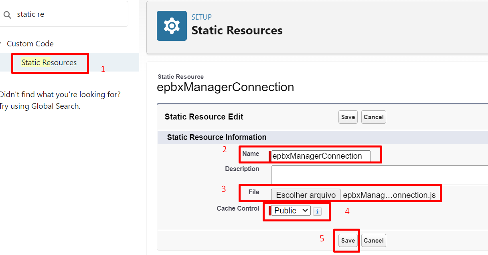

<!DOCTYPE html>
<body>
    
Setup básico do App no: <a src="https://github.com/talktelecom/salesforce">https://github.com/talktelecom/salesforce</a>

     
    
Todos os links <a src="https://manager.epbx.com.br">https://manager.epbx.com.br</a> precisam ser substituídos pelo link da integração do cliente.

     
    <h1>Passos:</h1>

    
Fazer deploy/upload do Recurso estático para o Salesforce que está presente na pasta "staticresource"/p>

    
Utilizar o nome epbxManagerConnection no recurso estático

    

    
Fazer deploy da Visualforce que está localizado na pasta "pages"

    
Obs: EpbxManager é a mesma página do repositório de "Setup básico do App", porém a versão presente neste repositório está <b>atualizada</b>.

</body>
</html>
